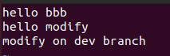
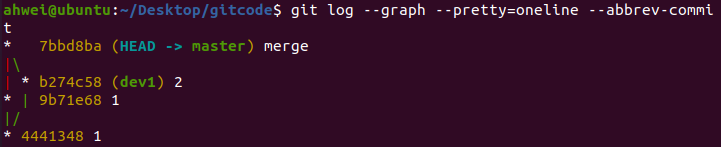
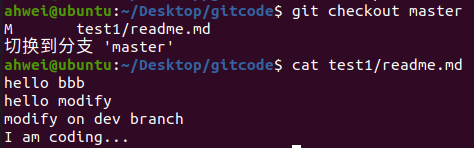

# Git 分支管理

## 一、理解分支

每次提交，Git 都会把他们串成一条时间线，这条时间线可以理解为一个分支。在创建 Git 仓库的时候，会自动创建一个主分支，即 master 分支。

再看一下 HEAD，HEAD 严格来说不是指向提交，而是指向 master，master 才是指向提交的，所以，HEAD 指向的就是当前分支。


每次提交，master 分支都会向前移动一步。这样，随着你不断提交，master 分支的线也越来越长，而 HEAD 只要一直指向 master 分支即可指向当前分支。

## 二、创建分支

首先查看当前本地所有分支：

```shell
git branch
```


**被 HEAD 指向的分支是当前工作分支**，上图中 master 前有 `*`，是指当前在 master 分支上工作。

然后创建一个 dev 分支：

```shell
git branch dev
```

此时我们可以看到新分支了：


然后我们发现新分支的 commit id 和 master 的一样


这是因为新分支也是基于最新一次提交创建的，关系如下图所示：


## 三、切换分支

新建好分支后需要切换分支，使用 checkout 命令：

```shell
git checkout dev
```


而且此时 HEAD 指针也指向了 dev 分支：


我们对 readme.md 文件做一些修改，发现：在 dev 分支里看到了修改；在 master 分支里则没有


则会使因为此时两个分支指向的提交是不一样的：


## 四、合并分支

为了在 master 主分支上能看到新的提交，就需要将 dev 分支合并到 master 分支。

```shell
git merge dev
```

Fast-forward 是快进模式，直接把 master 指向了 dev 的最新提交，当然，也不是每次合并都能 Fast-forward。


## 五、删除分支

不能在当前分支下删除当前分支：


我们切回主分支删除，删除的命令是

```shell
git branch -d dev
```


此时的状态如下图所示：


因为创建、合并和删除分支非常快，所以 Git 鼓励使用分支完成某个任务，合并后再删掉分支，这和直接在 master 分支上工作效果是一样的，但过程更安全。

## 六、合并冲突

在实际合并分支的时候，又时候会遇到代码冲突的问题，我们创建一个新的分支 dev1，并切换到目标分支，可以使用一条命令完成：

```shell
git checkout -b dev1
```

然后我们在这个分支下修改 readme.md 文件，把 ahwei 修改为 bbb：



把 master 分支对应位置改为 aaa：


这时直接合并会失败，因为冲突了：


这时查看 readme.md 文件：


当在使用 Git 进行版本控制时，如果在合并分支时遇到冲突，Git 会在发生冲突的文件中插入特殊标记来指示冲突的位置。这些标记包括 `<<<<<<<`、`=======` 和 `>>>>>>>`。

此时我们必须要⼿动调整冲突代码，**并需要再次提交修正后的结果**！！（再次提交很重要，切勿忘记）


用带参数的 git log 也可以看到分支的合并情况：

```shell
git log --graph --pretty=oneline --abbrev-commit
```



## 七、分支管理策略

通常合并分支的时候，如果可能，Git 会采用 Fast-forward 模式。

- 在 Fast-forward 模式下，删除分支后查看历史分支时，会丢掉分支信息，看不出来最新体骄傲到底是 merge 进来的还是正常提交的；
- 在合并冲突过程中，即使删除了分支，也能看到 master 分支其实是由其他分支合并得到的

Git 支持我们强制禁用 Fast-forward 模式，那么就会在 merge 的时候生成一个新的 commit，这样从分支历史上就可以看出分支信息，具体命令为：

```shell
git merge --no-ff -m "xxx" 分支名
```

其实 master 指向了一个新的提交：


**分支管理：**

在实际开发中，我们应该按照几个基本原则进行分支管理： 

- 首先，master 分支应该是非常稳定的，也就是仅用来发布新版本，平时不能在上面干活；
- 干活都在 dev 分支上


## 八、bug 分支

假设我们现在正在 dev2 分支上进行开发，开发到一半，突然发现 master 分支上面有 bug 需要解决，在 Git 中，每个 bug 都可以通过一个新的临时分支来修复，修复后，合并分支，然后将临时分支删除。

可现在 dev2 的代码在工作区中开发了一半还无法提交，怎么办？

例如，我在 dev2 分支上新增一行 I am coding... 表示当前分支正在开发中，这时修改了工作区的文件：



Git 提供了 git stash 命令，可以将当前的工作区信息进行储藏，被储藏的内容可以在将来某个时间恢复出来。


具体存在了哪里呢，我们 tree 一下 .git 的工作目录，发现此时多了一个 stash：


用 git status 查看工作区，就是干净的（除非有没有被 Git 管理的文件），因此可以放心地创建分支来修复bug。


储藏 dev2 工作区之后，由于我们要基于 master 分支修复 bug，所以需要切回 master 分支，再新建临时分支来修复 bug：

```shell
# 切回 master
ahwei@ubuntu:~/Desktop/gitcode$ git checkout master 
切换到分支 'master'
# 新建并切换到 fix_bug (临时分支修bug)
ahwei@ubuntu:~/Desktop/gitcode$ git checkout -b fix_bug
切换到一个新分支 'fix_bug'
# 修复 bug
ahwei@ubuntu:~/Desktop/gitcode$ vim test1/readme.md 
ahwei@ubuntu:~/Desktop/gitcode$ cat test1/readme.md 
hello bbb
hello fix_bug
modify on dev branch
# 重新 add commit
ahwei@ubuntu:~/Desktop/gitcode$ git add .
ahwei@ubuntu:~/Desktop/gitcode$ git commit -m "fix bug"
[fix_bug 2fac045] fix bug
 1 file changed, 1 insertion(+), 1 deletion(-)
# 切回 master 分支
ahwei@ubuntu:~/Desktop/gitcode$ git checkout master 
切换到分支 'master'
# 合并 bug 分支
ahwei@ubuntu:~/Desktop/gitcode$ git merge --no-ff -m "merge fix_bug" fix_bug
Merge made by the 'recursive' strategy.
 test1/readme.md | 2 +-
 1 file changed, 1 insertion(+), 1 deletion(-)
# 此时的工作区是干净的
ahwei@ubuntu:~/Desktop/gitcode$ git status
位于分支 master
无文件要提交，干净的工作区
```

至此，bug 修复工作结束，我们还要继续回到 dev2 分支进行开发：

```shell
# 切回 dev2 
ahwei@ubuntu:~/Desktop/gitcode$ git checkout dev2 
切换到分支 'dev2'
# 查看 stash 的工作现场
ahwei@ubuntu:~/Desktop/gitcode$ git stash list
stash@{0}: WIP on dev2: 7bbd8ba merge
# 使用 pop 命令恢复，恢复的同时也会把 stash 删了
# 另外，恢复现场也可以使用 git stash apply
# 但是恢复后需要 git stash drop 手动删除
ahwei@ubuntu:~/Desktop/gitcode$ git stash pop
位于分支 dev2
尚未暂存以备提交的变更：
  （使用 "git add <文件>..." 更新要提交的内容）
  （使用 "git restore <文件>..." 丢弃工作区的改动）
	修改：     test1/readme.md

修改尚未加入提交（使用 "git add" 和/或 "git commit -a"）
丢弃了 refs/stash@{0}（2ae9a712dc6a14fee132aac78d0fab324ecfcf16）
# 可以看到恢复了现场
ahwei@ubuntu:~/Desktop/gitcode$ cat test1/readme.md 
hello bbb
hello modify
modify on dev branch
I am coding...
# 继续 dev2 分支的开发
ahwei@ubuntu:~/Desktop/gitcode$ vim test1/readme.md 
ahwei@ubuntu:~/Desktop/gitcode$ git add .
ahwei@ubuntu:~/Desktop/gitcode$ git commit -m "develop done"
[dev2 82d2835] develop done
 1 file changed, 2 insertions(+)
# 合并的时候建议 不要直接把 dev2 分支合并到 master 中，因为这可能会冲突，手动解决冲突难免导致 master 分支再次 bug
# 建议先把 master 分支合并到 dev2 中，在 dev2 中解决冲突无误，再把 dev2 合并到 master 中
ahwei@ubuntu:~/Desktop/gitcode$ git merge --no-ff -m "merge master" master
自动合并 test1/readme.md
Merge made by the 'recursive' strategy.
 test1/readme.md | 2 +-
 1 file changed, 1 insertion(+), 1 deletion(-)
ahwei@ubuntu:~/Desktop/gitcode$ git checkout master
切换到分支 'master'
ahwei@ubuntu:~/Desktop/gitcode$ git merge -no-ff -m"merge dev2" dev2
error: did you mean `--no-ff` (with two dashes)?
ahwei@ubuntu:~/Desktop/gitcode$ git merge --no-ff -m"merge dev2" dev2
Merge made by the 'recursive' strategy.
 test1/readme.md | 2 ++
 1 file changed, 2 insertions(+)
```

## 九、删除临时分支

如何删除一个还没有被 merge 的分支？

> 实际开发中，可能产品经理提了一个需求，在你写了两三天 commit 了一些后，这个需求突然叫停，此时无法 merge 当前分支，怎么删除？

使用 -D 选项

```shell
git branch -D 分支名
```

