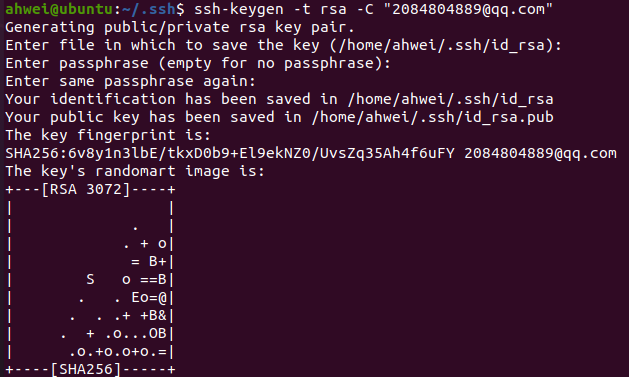
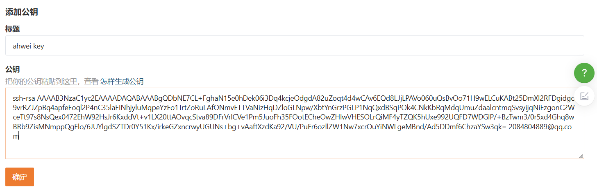
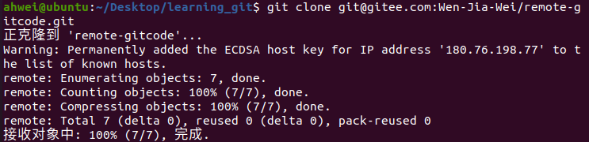

# 远程操作

## 一、分布式版本控制系统

我们目前所说的所有内容，都是在本地，而我们的 Git 其实是**分布式版本控制系统**。

我们每个人的电脑上都是一个完整的版本库，这样你在工作的时候，就不需要联网了，因为版本库就在你自己的电脑上。如果你在自己的电脑上修改了文件，你的同事也在他的电脑上修改了文件，这时，你们俩之间只需要把各自的修改推送给对方，就可以互相看到对方的修改了。

分布式版本控制系统的安全性要高很多，因为每个人电脑里都有完整的版本库，某一个人的电脑坏掉了不要紧，随便从其他人那里复制一个就可以了。

在实际使用分布式版本控制系统的时候，其实很少在两人之间的电脑上推送版本库的修改，因为可能你们俩不在一个局域网内，两台电脑互相访问不了。因此，分布式版本控制系统通常也有一台充当“**中央服务器**”的电脑，但这个服务器的作用仅仅是用来方便“交换”大家的修改，没有它大家也一样干活，只是交换修改不方便而已。


## 二、远程仓库

其实一台电脑上也是可以克隆多个版本库的，只要不在同一个目录下。不过，现实生活中是不会有人这么傻的在一台电脑上搞几个远程库玩，因为一台电脑上搞几个远程库完全没有意义，而且硬盘挂了会导致所有库都挂掉。
实际情况往往是这样，找一台电脑充当服务器的角色，每天24小时开机，其他每个人员都从这个“服务器”仓库克隆一份到自己的电脑上，并且各自把自己的提交推送到服务器仓库里，也从服务器仓库中拉取别人的提交。

### 1.新建远程仓库

在注册好 gitee 后，就可以开始创建仓库了：


- Readme 文件：介绍本仓库

- Issue 模板文件：

  Issue 是对仓库问题的提问，我们新建一个 Issue，会默认跳出来 模板文件中预先设置好的内容：

  

  右边还可以勾选一些信息：

  

  创建完成后，代办人通过修改状态可以解决这个问题：

  

- Pull Request 模板文件：

  在实际开发中，把其他分支合并到主分支上是一个非常危险的行为，所以要通过提交一个申请来进行合并。

### 2.克隆远程仓库

克隆/下载远程仓库到本地，需要使用 git clone 命令，后面跟上我们的远端仓库的链接，远端仓库的链接可以从仓库中找到：


SSH 协议和 HTTPS 协议是 Git 最常使用的两种数据传输协议。SSH 协议使用了公钥加密和公钥登录机制，体现了其实用性和安全性，使用此协议需要将我们的公钥放上服务器，由 Git 服务器进行管理。使用 HTTPS 方式时，没有要求，可以直接克隆下来：

#### 2.1 HTTPS 方式

**使用 git clone 时不能在任何一个本地仓库下，其他位置都行**

```shell
git clone https://gitee.com/Wen-Jia-Wei/remote-gitcode.git
```


此时远程仓库和本地仓库如下：


origin 是远程仓库的默认名字，可以用 git remote 查看，`-v` 查看详细信息：


其中，fetch 是拉取，push 是推送。

#### 2.2 SSH方式

直接使用 SSH 方式克隆会出错，权限拒绝，public key 出错了。


由于我们没有添加公钥到远端库中，服务器拒绝了我们的 clone 链接。需要我们设置一下：

1. 创建 SSH Key，在用户主目录下，看看有没有 .ssh 目录，再看看这个目录下有没有 id_rsa 和 id_rsa.pub 这两个文件，如果已经有了，可以直接跳到下一步。如果没有，则需要创建 SSH Key：

   ```shell
   ssh-keygen -t rsa -C "2084804889@qq.com"
   # 这里的邮箱必须和码云上的邮箱保持一致
   ```

   输入自己的邮箱，然后一路回车，使用默认值即可：

   

   然后可以再用户主目录里找到 .ssh 目录，里面由 id_rsa 和 id_rsa.pub 两个文件，这两个就是 SSH Key 的密钥对，id_rsa 是私钥，不能泄露出去，id_rsa.pub 是公钥，可以放心的告诉任何人。

   

2. 添加自己的公钥到远端仓库

   

   这时候是成功的：

   

   当我们从远程仓库克隆后，实际上 Git 会自动把本地的 master 分支和远程的 master 分支对应起来，并且，远程仓库的默认名称是 origin 。

### 3.向远程仓库推送

1. 首先配置 name 和 email：

   

2. git push

   ```shell
   git push origin master:master
   # origin 代表远程仓库
   # 左边的 master 代表本地仓库分支，右边的 master 代表远程仓库分支，如果两个分支名一样可以简写：git push origin master
   # git push <远程主机名> <本地分⽀名>:<远程分⽀名>
   ```

   

   推送是分支和分支之间的操作，所以本地分支和远程分支必须建立联系，而 master 分支在克隆仓库的时候就已经建立好了联系了。

### 4.拉取远程仓库

远程仓库分支领先于本地仓库分支时可以进行拉取操作，这里为了演示，在远程仓库直接修改一些代码使其领先（实际开发中不要这么做）


## 三、配置 git

### 1.忽略特殊文件

在 Git 工作区的根目录下创建一个特殊的 `.gitignore` 文件，然后把要忽略的文件名填进去，Git 就会自动忽略这些文件了。

gitee 在创建仓库的时候可以为我们生成 `.gitignore` 文件，需要我们勾选：


如果当时没有这个选择，在在工作区创建一个也是可以的。无论哪种方式，最终都可以得到一个完整的 `.gitignore` 文件。

```shell
# 省略选择模本的内容
...
# My configurations:
# 省略一类文件
*.ini
*.so
# 省略某个具体的文件
a.txt
# 不省略某个文件
!a.so
```

想添加一个文件到 Git，但是这个文件被 `.gitignore` 忽略了：

**方法一：**

```shell
git add -f [filename]
```

如果这个 `.gitignore` 已经非常庞大了，你不记得省略过什么。可以用 `git check-ignore` 命令检查：

```shell
git check-ignore -v b.so
```

**方法二：**

```shell
# 不省略某个文件
!a.so
```

### 2.给命令配置别名

将 git status 简化为 git st：

```shell
git config --global alias.st status
```

配置一个 git last，让其显示最后一次提交信息：

```shell
git config --global alias.last 'log -1'
```

`--global` 参数是全局参数，也就是这些命令在这台电脑的所有Git仓库下都有用。如果不加，那只针对当前的仓库起作用。
