# 标签管理

## 一、理解标签

标签 tag，可以理解为是对某次 commit 的一个标识，相当于起了一个别名。例如，在项目发布某个版本的时候，针对最后一次 commit 起一个 v1.0 这样的标签来标识里程碑的意义。

相较于难以记住的 commit id，tag 很好地解决这个问题，因此 tag 一定要给一个让人容易记住，且有意义的名字。当我们需要回退到某个重要版本时，直接使用标签就能很快定位到。

## 二、创建标签

```shell
git tag [name]
```

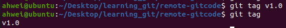

默认标签是打在最新提交的 commit 上的。在指定的 commit 上打标签需要 commit id。

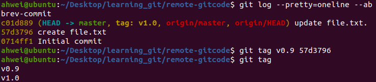

注意：标签不是按时间顺序列出的，而是按字母顺序排序的。

可以用 `git show [tagname]` 查看标签信息：


Git 还提供可以创建带有说明的标签，用 -a 指定标签名，-m 指定说明文字，格式为：

```shell
git tag -a [name] -m "XXX" [commit_id]
```

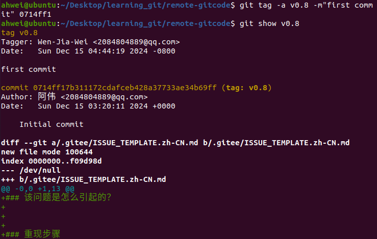

此时，使用 `tree .git` 命令查看本地库，可以看到我们创建的标签：

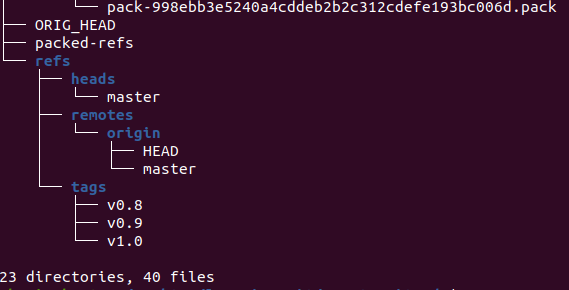

## 三、操作标签

### 1.删除标签

使用 -d 选项删除标签：

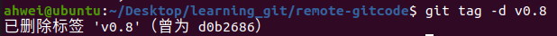

### 2.远程推送

- 推送单个标签：

  ```shell
  git push origin v1.0
  ```

  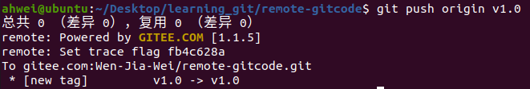

  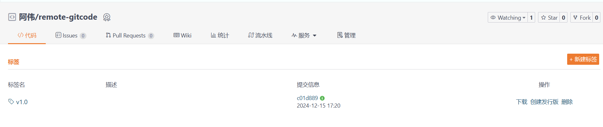

- 推送所有标签：

  ```shell
  git push origin --tags
  ```

  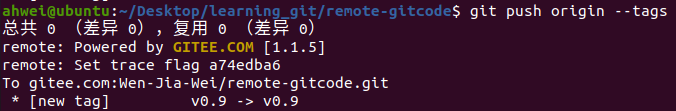

  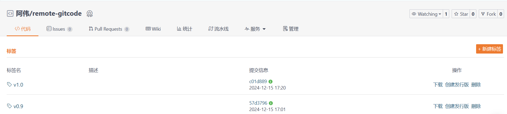

- 删除远程标签

  - 先从本地删除

    ```shell
    git tag -d v1.0
    ```

    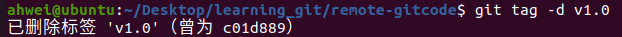

  - 然后从远程删除，删除命令也是 push

    ```shell
    git push origin :refs/tags/v1.0
    # git push origin :v1.0 也可
    ```

    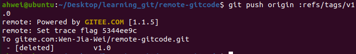

  - 查看码云，确实删除成功：

    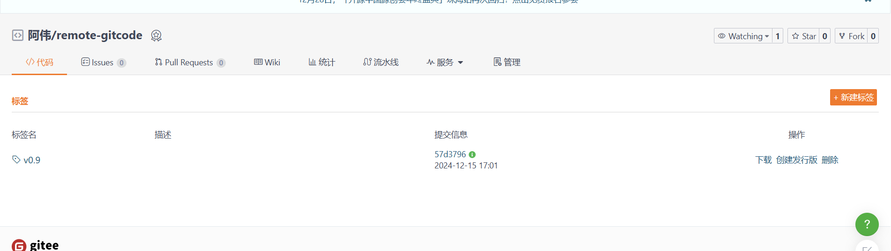