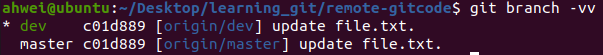
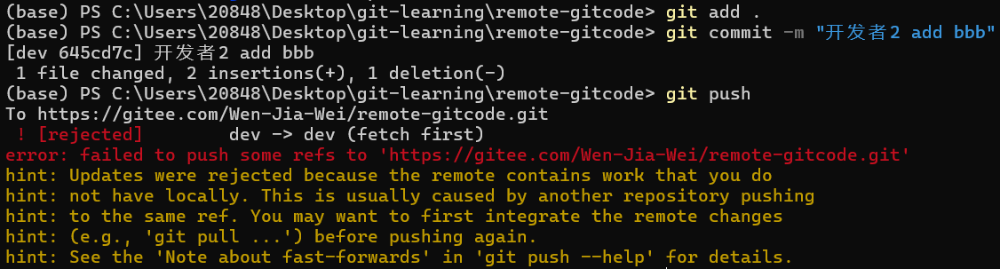
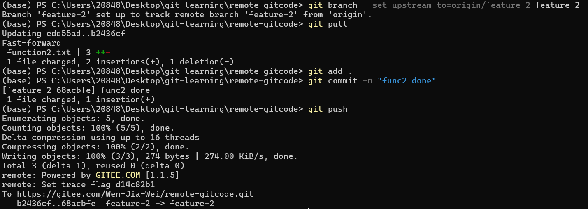

# 多人协作

## 一、多人协作一

**目标：** master 分支下 file.txt 文件新增代码 "aaa"、"bbb"

**实现：** 由开发者1新增"aaa"，由开发者2新增"bbb"

**条件：** 在一个分支下协作完成

1. 先在远程基于 master 分支新建一个分支

   

   现在的仓库状态是：

   

   本地有一个 master 分支，远程有一个 origin/master 分支：

   ```shell
   ahwei@ubuntu:~/Desktop/learning_git/remote-gitcode$ git branch
   * master
   ahwei@ubuntu:~/Desktop/learning_git/remote-gitcode$ git branch -r
     origin/HEAD -> origin/master
     origin/master
   ```

2. 拉取远程，可以看到拉取下来了 dev 分支。用 git branch -a 查看（查看远程和本地的分支）：

   ```shell
   ahwei@ubuntu:~/Desktop/learning_git/remote-gitcode$ git pull
   来自 gitee.com:Wen-Jia-Wei/remote-gitcode
    * [新分支]          dev        -> origin/dev
   已经是最新的。
   ahwei@ubuntu:~/Desktop/learning_git/remote-gitcode$ git branch -a
   * master
     remotes/origin/HEAD -> origin/master
     remotes/origin/dev
     remotes/origin/master
   ```

   此时，仓库状态是：

   

3. 开发者2，用 Windows 模拟，首先克隆远程仓库：

   

   此时仓库状态为：

   

4. 开发者1在本地创建 dev 分支，并建立和远程 dev 分支的联系：

   

   最后面的 origin/dev 代表和远程 dev 分支建立链接，此时，查看这个链接，使用 -vv 选项：

   

   建立链接有什么用？使用 git push/pull 时，可以使用短命令 `git push`/pull，不用像之前那样 `git push/pill origin dev` 了

5. 开发者1新增 aaa：

   

6. 开发者2在本地创建 dev 分支，并和远程 dev 分支建立链接：

   

   这次我们使用 `git branch --set-upstream-to=origin/dev dev` 命令，也能完成链接操作。

7. 开发者2新增 bbb：

   直接 push 会报错：

   

   需要先 pull，再 push：

   

   

   

   提交：

   

8. 将内容合并进 master：

   - PR：

     ```mermaid
     graph LR
         a[合并申请单] --> b[管理员审批]
         b --> c[merge]
         style a fill:#fff,stroke:#ff9900,stroke-width:2px
         style b fill:#fff,stroke:#ff9900,stroke-width:2px
         style c fill:#fff,stroke:#ff9900,stroke-width:2px
     ```

     

   - 本地操作：

     master 分支 merge dev 分支，先让 dev merge master，这样，有冲突可以在 dev 解决。

     1. pull 远程 master 保证 本地 master 最新：

        

     2. dev merge master

        

     3. master merge dev

        

【总结】在同一分支下进行多人协作的工作模式通常是这样： 
- 首先，可以试图用 `git push origin branch-name` 推送自己的修改；  
- 如果推送失败，则因为远程分支比你的本地更新，需要先用 `git pull` 试图合并；
- 如果合并有冲突，则解决冲突，并在本地提交；  
- 没有冲突或者解决掉冲突后，再用 `git push origin branch-name` 推送就能成功； 
- 功能开发完毕，将分支 merge 进主分支（如 `master` 或 `main`），最后删除分支。

## 二、多人协作二

**目标：** 远程 master 分支下新增 function1 和 function2 文件

**实现：** 由开发者1新增 function1，开发者2新增 function2

**条件：** 在不同分支下协作完成

> [!NOTE]
>
> 创建分支：
>
> - 远程创建分支：可以基于 master 分支直接创建
> - 本地创建分支：最好先 pull 最新的 master 分支下来，再创建分支，最后还需要 push 到远程

两种方式均可，第一种方式更简便一些，一下我们使用第二种方式完成。

- 开发者1：

  - 新建一个分支

    ```shell
    git checkout -b feature-1
    ```

  - 创建一个文件并写一些东西：

    ```shell
    vim function1
    ```

    

  - add 并 commit

    ```shell
    git add .
    git commit -m "add func1"
    ```

  - push

    由于远程没有 feature1 分支，不能建立链接，我们直接：

    ```shell
    git push origin feature-1
    ```

    

    现在我们查看远程分支时，发现已经有了 feature-1 分支：

    

- 开发者2：

  - 先切到 master 分支，再 pull 最新的 master

    

  - 然后类似开发者1，创建  function2.txt 并提交推送

    

> [!NOTE]
>
> git pull
>
> - 拉取分支内的内容：需要建立链接
> - 拉取仓库内容：不需要建立链接

- 开发者2病了，开发者帮开发者2开发：

  先拉取远程仓库内容，获取到 feature2：

  

  然后新建分支2，并和远程分支2建立链接：

  ```shell
  git checkout -b feature-2 origin/feature-2
  ```

  最后修改 function2.txt 再推送。

- 开发者2 病好了，继续开发

  

- 合并：

  

  

  合并 feature1 分支时，可能会冲突，在解决冲突的时候可能把 master 搞坏了。所以先把 master 分支合并到 feature1 分支，没问题后，再合并回去

  - master 合并到 feature1：

    ```shell
    ahwei@ubuntu:~/Desktop/learning_git/remote-gitcode$ git checkout master
    切换到分支 'master'
    您的分支与上游分支 'origin/master' 一致。
    ahwei@ubuntu:~/Desktop/learning_git/remote-gitcode$ git pull
    remote: Enumerating objects: 7, done.
    remote: Counting objects: 100% (7/7), done.
    remote: Compressing objects: 100% (3/3), done.
    remote: Total 4 (delta 1), reused 0 (delta 0), pack-reused 0
    展开对象中: 100% (4/4), 1.16 KiB | 1.16 MiB/s, 完成.
    来自 gitee.com:Wen-Jia-Wei/remote-gitcode
       7fbb8c7..b6c209b  master     -> origin/master
       b2436cf..68acbfe  feature-2  -> origin/feature-2
    更新 7fbb8c7..b6c209b
    Fast-forward
     function2.txt | 3 +++
     1 file changed, 3 insertions(+)
     create mode 100644 function2.txt
    ahwei@ubuntu:~/Desktop/learning_git/remote-gitcode$ git checkout feature-1
    切换到分支 'feature-1'
    ahwei@ubuntu:~/Desktop/learning_git/remote-gitcode$ git merge master
    Merge made by the 'recursive' strategy.
     function2.txt | 3 +++
     1 file changed, 3 insertions(+)
     create mode 100644 function2.txt
    ahwei@ubuntu:~/Desktop/learning_git/remote-gitcode$ git push origin feature-1
    枚举对象中: 4, 完成.
    对象计数中: 100% (4/4), 完成.
    使用 2 个线程进行压缩
    压缩对象中: 100% (2/2), 完成.
    写入对象中: 100% (2/2), 309 字节 | 309.00 KiB/s, 完成.
    总共 2 （差异 1），复用 0 （差异 0）
    remote: Powered by GITEE.COM [1.1.5]
    remote: Set trace flag 5b43f1ba
    To gitee.com:Wen-Jia-Wei/remote-gitcode.git
       8c2ef1a..bf88df2  feature-1 -> feature-1
    ```

  - 然后再按之前的流程，把 feature1 合并到 master

## 三、远程分支删除后，本地 git branch -a 依然能看到的解决办法


```shell
git remote show origin
```


此时我们可以看到那些远程仓库已经不存在的分支，根据提示，使用 git remote prune origin 命令


此时，那些远程分支已被修剪了：


