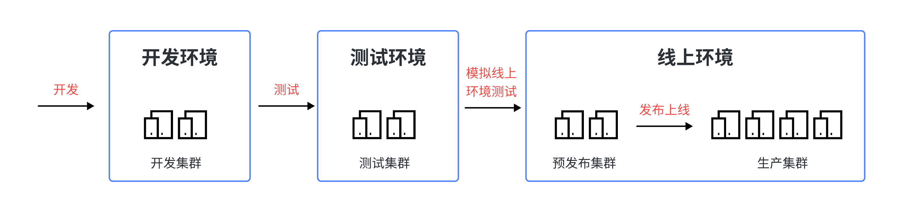

# 企业级开发模型

## 一、系统开发环境

1. 开发环境：开发环境是程序员们专门用于日常开发的服务器。为了开发调试方便，一般打开全部错误报告和测试工具，是最基础的环境。 
2. 测试环境：一个程序在测试环境工作不正常，那么肯定不能把它发布到生产机上。该环境是开发环境到生产环境的过渡环境。 
3. 预发布环境：该环境是为避免因测试环境和线上环境的差异等带来的缺陷漏测而设立的一套环境。其配置等基本和生产环境一致，目的是能让我们发正式环境时更有把握！所以预发布环境是产品质量的最后一道防线，因为下一步项目就要上线了。要注意预发布环境服务器不在线上集成服务器范围之内，是单独的一些机器。
4. 生产环境：是指正式提供对外服务的线上环境，例如我们目前在移动端或PC端能访问到的APP都是生产环境。

这几个环境也可以说是系统开发的三个重要阶段： $\text{开发}\rightarrow\text{测试}\rightarrow上线$，如下如所示：

对于规模稍微大点的公司来说，可不只这么几个环境，比如项目正式上线前还存在仿真/灰度环境，再比如还存在多套测试环境，以满足不同版本上线前测试的需要。

 一个项目的开始从设计开始，而一个项目的成功则从测试开始。一套良好的测试体系可以将系统中绝大部分的致命Bug解决在系统上线之前。测试系统的完善和成熟也是衡量一个软件企业整体水平的重要指标之一，测试往往被忽视，因为它对可以的隐性、对软件开发企业不产生直接的效益，但是它却是软件质量的最终保障，乃至项目能否成功的重要因素！

## 二、Git 分支设计规范

| 分支 | 名称 | 适用环境 |
| :--: | :--: | :--: |
| master | 主分支 | 生产环境 |
| release | 预发布分支 | 预发布/测试环境 |
| develop | 开发分支 | 开发环境 |
| feature | 需求开发分支 | 本地 |
| hotfix | 紧急修复分支 | 本地 |

注：以上表格中的分支和环境的搭配仅是最常用的一种，可视情况而定不同的策略。

### 1.master 分支

- master 是主分支，该分支为只读且唯一分支。用于部署到正式发布环境，一般由合并 release 分支得到
- 主分支作为稳定的唯一代码库，任何情况下不允许直接再 master 分支上修改代码
- 产品的功能全部实现后，最终在 master 分支对外发布，另外所有在 master 分株的推送应该打标签（tag）做记录，方便追溯
- master 分支不可删除

### 2.release 分支

- release 为预发布分支，基于本次上线所有的 feature 分支合并到 develop 分支之后，再基于 develop 分支创建，可以部署到测试或预发布集群
- 命名以 release/ 开头，建议的命名规则：release/version_publishtime
- release 分支主要用于提交给测试人员进行功能测试。发布提测阶段，会以 release 分支为基准进行提测。
- 如果在 release 分支测试出问题，需要回归验证 develop 分支看是否存在此问题
- release 分支属于临时分支，产品上线后可选删除

### 3.develop 分支

- develop 分支为开发分支，基于 master 分支创建的只读且唯一分支，始终保持最新完成以及 bug 修复后的代码，可部署到开发环境对应集群。
- 可根据需求大小程度确定是由 feature 分支合并，还是在上面开发（非常不建议）

### 4.feature 分支

- feature 分支通常为新功能或新特性开发分支，以develop 分支为基础创建 feature 分支
- 命名以 feature/ 开头，建议的命名规则：feature/user_createtime_feature
- 新特性或新功能开发完成后，开发人员需合到 develop 分支
- 一旦该需求发布上线，便将其删除

### 5.hotfix 分支

- hotfix 分支为线上 bug 修复分支或叫补丁分支，主要用于对线上的版本进行 bug 修复。当线上出现紧急问题需要马上修复时，需要基于 master 分支创建 hotfix 分支
- 命名以 hotfix/ 开头，建议的命名规则：hotfix/user_createtime_hotfix
- 当问题修复完成后，需要合并到 master 分支和 develop 分支并推送远程，一旦修复上线，便将其删除

以上模型是企业级常用的一种 Git 分支规范设计：**Git Flow 模型**

## 三、企业级项目管理实战

### 1.准备工作

DevOps研发平台

[Gitee 企业版 - 企业级 DevOps 研发效能平台](https://gitee.com/enterprises)

首先注册一个企业：

然后创建项目，选择敏捷项目：

然后创建仓库：

### 2.开发场景（基于 git flow 模型的实践）

基于 develop 创建分支

在 feature 分支上做一些开发后，我们再把 feature 分支合并到 develop 分支上：

审查和测试通过后就可以合并了，接下来再创建一个 release 分支：

然后把 release 分支合并到 master 分支：

然后把不用的分支删掉。

### 3.其他分支模型

[项目版本管理的最佳实践：飞流Flow（阿里AoneFlow）篇-CSDN博客](https://blog.csdn.net/bbcckkl/article/details/111087267)