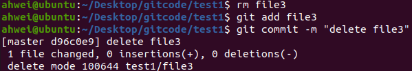
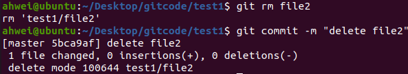

# Git 基本操作

### 一、创建 Git 本地仓库

### 1.初始化仓库

仓库是进行版本控制的一个文件目录，我们要想对文件进行版本控制，就必须先创建一个仓库出来。

```shell
git init
```


我们发现，当前目录下多了一个 `.git` 的隐藏文件，它是用来跟踪管理仓库的。


### 2.配置 Git

当安装Git后首先要做的是设置你的用户名称和e-mail地址，这是非常重要的。配置命令为：

```shell
git config [--global] user.name "Your Name" # 配置用户名
git config [--global] user.email "email@example.com" # 配置密码
git config -l # 查看配置
```

- `--global` 是一个可选项，如果使用了该选项，表示这台机器上所有的 Git 仓库都会使用这个配置。如果希望在不同的仓库中使用不同的 name 和 email，就不要带这个选项
- 执行命令时必须要在仓库里


删除对应配置命令为：

```shell
git config [--global] --unset user.name
git config [--global] --unset user.email
```


## 二、工作区、暂存区和版本库

- 工作区：电脑上要写代码的文件或目录
- 暂存区：英文叫 stage 或 index，一般存在 `.git` 目录下的 index 文件 （`.git/index`），我们把暂存区有时也叫做索引
- 版本库：工作区的一个隐藏目录 `.git`，它不是工作区，而是 Git 的版本库。这个版本库里面的所有文件都可以被 Git 管理起来，每个文件的修改、删除，Git 都能跟踪

下图展示了工作区、暂存区和版本库之间的关系：


- 在创建 Git 版本库时，Git 会为我们自动创建一个唯一的 master 分支，以及指向 master 的一个指针 HEAD
- 当对工作区新增或修改的文件执行 `git add` 命令时，暂存区目录树的文件索引会被更新
- 当执行提交操作 `git commit` 时，master 分支会做相应的更新，可以简单理解为暂存区的目录树被真正写入版本库中
- objects：修改的工作区内容会写入对象库的一个 git 对象中

**一次 add 一次 commit：**


**多次 add 一次 commit：**


查看提交记录：

```shell
git log
```


该命令显示从最近到最远的提交日志，并且可以看到我们 commit 时的日志消息。

```shell
git log --pretty=oneline
```

 加上 `--pretty=oneline` 参数可以显示简要信息。


此时我们首先查看 `.git` 的目录结构：

```shell
ahwei@ubuntu:~/Desktop/gitcode$ tree .git
.git
├── branches
├── COMMIT_EDITMSG
├── config
├── description
├── HEAD
├── hooks
│   ├── applypatch-msg.sample
│   ├── commit-msg.sample
│   ├── fsmonitor-watchman.sample
│   ├── post-update.sample
│   ├── pre-applypatch.sample
│   ├── pre-commit.sample
│   ├── pre-merge-commit.sample
│   ├── prepare-commit-msg.sample
│   ├── pre-push.sample
│   ├── pre-rebase.sample
│   ├── pre-receive.sample
│   └── update.sample
├── index
├── info
│   └── exclude
├── logs
│   ├── HEAD
│   └── refs
│       └── heads
│           └── master
├── objects
│   ├── 08
│   │   └── b596d9e8b27bd96f902f8cdebd0f8372c7df80
│   ├── 43
│   │   └── 071e46f42a886822c5b64e2f48da3f29f9513f
│   ├── 78
│   │   └── d3bb7cbd27c3e9cdc622e25dcd50589f4542d5
│   ├── 97
│   │   └── 844ff85b3f8947b9c8399f285d8b946ca408e9
│   ├── 9c
│   │   └── ff7a257334ab05c92da27e22e9df9c1f5bd4cc
│   ├── bc
│   │   └── 099ecb170293e53a0ed47a575fc64a4125b6c3
│   ├── e6
│   │   └── 9de29bb2d1d6434b8b29ae775ad8c2e48c5391
│   ├── f9
│   │   └── 366244be01b39eda3ef9376b14f74bb7b9a4cf
│   ├── info
│   └── pack
└── refs
    ├── heads
    │   └── master
    └── tags

20 directories, 29 files
```

- index 就是我们的暂存区，add 后的内容都是添加到这里的

- HEAD 就是我们的默认指向 master 的分支的指针：

  ```shell
  ahwei@ubuntu:~/Desktop/gitcode$ cat .git/HEAD
  ref: refs/heads/master
  ```

  而默认的 master 分支，其实就是：

  ```shell
  ahwei@ubuntu:~/Desktop/gitcode$ cat .git/refs/heads/master
  f9366244be01b39eda3ef9376b14f74bb7b9a4cf
  ```

  打印的 f9366244be01b39eda3ef9376b14f74bb7b9a4cf 就是当前最新的 commit id 

- objects 为 Git 的对象库，里面包含了创建各种版本库对象及内容。当执行 `git add` 命令时，暂存区的目录树被更新，同时工作区修改或新增的文件内容被写入到对象库中的一个新的对象中，就位于 `.git/objects` 目录下：

  ```shell
  ahwei@ubuntu:~/Desktop/gitcode$ ls .git/objects/
  08  43  78  97  9c  bc  e6  f9  info  pack
  ```

  查找 object 时要将 `commit id` 分成两部分，其中前两位是文件夹名称，后38位是文件名称。

  用 `git cat-file` 命令查看版本库对象的内容：

  ```shell
  ahwei@ubuntu:~/Desktop/gitcode$ git cat-file -p f9366244be01b39eda3ef9376b14f74bb7b9a4cf
  tree 9cff7a257334ab05c92da27e22e9df9c1f5bd4cc
  parent 43071e46f42a886822c5b64e2f48da3f29f9513f
  author ahwei <202103151422@zjut.com> 1731228550 -0800
  committer ahwei <202103151422@zjut.com> 1731228550 -0800
  
  add 3 files
  ```

  

  查看 readme.md 对应的 object：

  

  我们对 readme.md 的修改被 git 记录下来了

## 三、修改文件

**Git 跟踪并管理的是修改，而非文件。**

我们先对 readme.md 文件进行一次修改：


此时仓库中的 readme.md 和我们工作区的 readme.md 是不同的，我们用 `git status` 命令查看在上次提交之后是否有对文件的修改。


我们可以看到 readme.md 文件被修改过了，但还没有完成添加与提交。而且这里我们只能知道修改了哪些文件，而不知道具体修改的内容。

```shell
git diff test1/readme.md
```


`git diff [file]` 命令用来显示暂存区和工作区文件的差异，显示的格式是 unix 通用的 diff 格式。

也可以用 `git diff HEAD -- [file]` 命令来查看版本库和工作区文件的区别：

![git diff HEAD -- [file]](./pic/git diff HEAD -- [file].png)

`git add` 之后，就没有看到上面 `no changes added to commit (use "git add" and/or "git commit -a")` 的消息了


然后 commit，此时 status 是：


## 四、版本回退

`git reset` 命令用于回退版本，可以指定回退某一次提交的版本，回退的本质是将版本库中的内容进行回退，工作区或暂存区是否回退由命令参数决定：

```shell
git reset [--soft | -- mixed | --hard] [HEAD]
```

|                           | 工作区 | 暂存区 | 版本库 |
| :-----------------------: | :----: | :----: | :----: |
| hard（<mark>慎用</mark>） |  回退  |  回退  |  回退  |
|           soft            |  不变  |  不变  |  回退  |
|       mixed（默认）       |  不变  |  回退  |  回退  |

- HEAD 说明：
  - 可以直接写成 commit id，表示指定回退的版本
  - HEAD 表示当前版本
  - HEAD^ 表示上一个版本
  - HEAD^^ 上上个版本
  - ……  以此类推
- 可以用~数字表示：
  - HEAD~0 表示当前版本
  - HEAD~1 上一个版本
  - HEAD~2 上上个版本
  - ……  以此类推

目前最新版本工作区有四个文件：


回退到第一次提交的时候：


此时 HEAD 指针也指向了第一次提交的时候的版本：


此时已经没有其他 `commit id` 了，我后悔了这次的回退，该怎么办？用 `reflog` 命令：


但是在实际工作中，由于长时间开发，导致 `commit id` 早就找不到了，这时候将无法回退到你想要的哪个版本。

Git 的版本回退速度非常快，因为 Git 在内部有个指向当前分⽀（此处是 master）的 HEAD 指针，`refs/heads/master` 文件里保存当前 master 分⽀的最新 `commit id`。当我们在回退版本的时候，Git仅仅是给 `refs/heads/master` 中存储一个特定的 version，可以简单理解成如下示意图：


## 五、撤销修改

|    工作区     |    暂存区     |    版本库     | 解决方式                                                     |
| :-----------: | :-----------: | :-----------: | :----------------------------------------------------------- |
| modified code |               |               | 1.手动修改，不推荐，容易出错<br />2.git checkout -- [filename] |
| modified code | modified code |               | 1.git reset --hard HEAD<br />2.git reset HEAD + git checkout -- [filename] |
| modified code | modified code | modified code | <mark>前提条件：commit 后没有 push</mark><br />git reset --hard HEAD^ |

## 六、删除文件

### 1.方式一

方式一分三步：



### 2.方式二

方式二有两步，`git rm` 同时删除了工作区和暂存区的文件：

